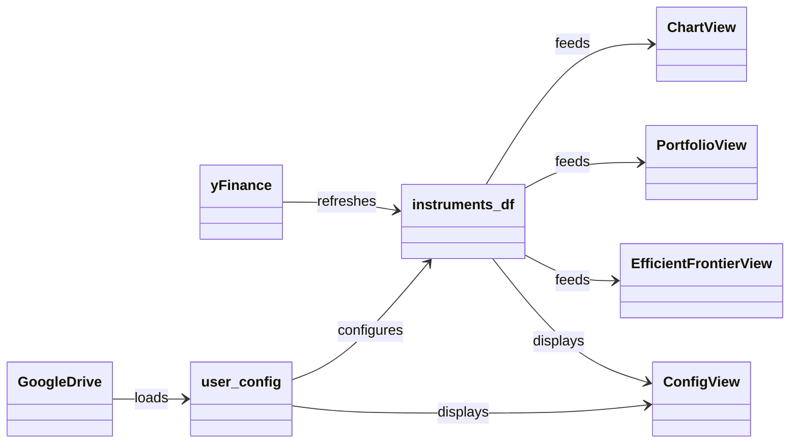

# STONKULATOR - DESIGN DOCUMENT

**Project**: Stonkulator: Bob's Personal Stock Portfolio Analysis and Simulation Toolkit 
**Author**: Bob Date: 2025-08-09 
**Version**: 1.0
**Development Environment**: Google Colab, Python, Panel

### 1. **Project Overview** (End-user requirements)

**Purpose:** Stonkulator is a personal stock market dashboard built in python using the Panel and yFinance libraries. Its goal is to display stock market data for selected financial instruments as charts and calculate returns, key statistics and run simulations of relevant market information.

**Solution:** A dashboard using Panel and yFinance to display key instrument information across multiple panels. Each panel is dedicated to one goal. The code is written in a Google Colab notebook that serves a webapp of the dashboard. Data is cached to improve performance.

**Goals:** 
1. Single instrument analysis section with a chart and multiple technical indicators.
2. Portfolio view with all instruments and key statistics for each.
3. Efficient frontier calculation using all S&P500 stocks and instruments in the portfolio.

**Target Audience:** Single user with several portfolios.

**Scope:** 
- In scope:
	- Equities and ETF instruments
	- Daily OHLCV data pulling
	- Charts and dashboards
	- Technical analysis
	- Efficient Frontier Simulations
- Out of scope:
	- Options, Forex, Bonds, CFDs, Crypto instruments
	- Depth of book data (eg. open orders at each price point)
	- Authentication and logins
	- Encryption
	- Trading and broker integration
	- Strategy analysis / simulation
	- Backtesting
	- Logging

### 2. **System Architecture**

**Technology Stack:**
1. **Frontend:** Panel-powered dashboard.
2. **Backend:** Python scripts within notebook; all logic contained in visible cells (no separate backend server); logic is separated in self contained cells; text cells placed prior to each code cell with a description and appropriately nested heading; project structure is organized into section visible via the Colab Table of contents.
3. **Data Source:** yFinance API provides live stock / financial instrument data. Data is cached to improve performance to a DuckDB database. The architecture is organized for a timeseries friendly querying approach. 
4. **Persistence:** Google Drive (via Colab integration) for saving / loading user portfolios and other configuration files. The DuckDB database is saved as a single file.

**Major Components:**
- Backend / user_config: google sheets file with the user portfolio and other configs.
- Backend / instruments_df: pulls live data with yFinance for all instruments. Performs additional calculations. Keeps at least 5 years of daily data for each instrument. Manages data freshness by checking for new daily data. Caches data in Panel to improve performance. Uses DuckDB as core backend database.
- Frontend / Chart view: single instrument viewer panel with a large stock chart and key statistics, and technical indicators.
- Frontend / Portfolio view: list of instruments in the users portfolio with key statistics calculated for each.
- Frontend / Efficient frontier view: simulation of the efficient frontier from all instruments in the instrument_df.
- Frontend / Config viewer: a panel to confirm what user config has been loaded and statistics on which instruments are loaded, how many days of data are available and first and last datapoint.

**Data Flow:**

**Key Decisions:**
- Colab is chosen because its free and already available with my Google account.
- Google Drive is used for config and storage for the easy Colab integration.
- Panel was chosen over Streamlit because its part of the Jupyter ecosystem.
- yFinance provides free and very reliable stock data, including critically important adjusted close data. Good enough for this level of analysis.
- Serving will be done either locally (just in the Colab notebook) of via ngrok tunnel to the notebook. More advanced options like deploying to a cloud function will not be explored at this stage.

### 3. **Implementation Plan**

1. **MVP 1: Basic Data Pipeline**: User can access a dashboard showing live stock data for one ticker (^GSPC).
	- [ ] Install core libraries (Panel, yFinance, Google APIs) in Colab
	- [ ] Set up ngrok to serve dashboard
	- [ ] Create Panel app fetching one stock with yFinance
	- [ ] Chart View: display basic stock price chart. See stock chart from example dashboard "portfolio_analyzer.ipynb"

2. **MVP 2: User Configuration**: User can load list of instruments to see their data.
	- [ ] Connect to Google Sheets for user settings
	- [ ] Make settings view to confirm what is loaded
	- [ ] Live/easy refresh of sheets data (Basic: very easy to refresh sheets data; Stretch: make it refresh automatically when sheet changes) 
	- [ ] Pick instrument from list to change stock chart

3. **MVP 3: Portfolio Tracking**: User can track portfolio performance with holdings data.
	- [ ] Portfolio View: show all portfolio instruments in a table together. Make it refresh together with user settings refresh
	- [ ] Calculate and show daily returns in % and absolute, show currency, total P&L for position
	- [ ] Calculate trailing annualized figures: annualized returns and volatility
	- [ ] Add sort and filter features to table: eg. sort by name, % returns, etc.. Add interactive features like action and notes as shown in the example dashboard "portfolio_analyzer.ipynb"

4. **MVP 4: Data Persistence**: Data is stored between sessions, loads quickly and only minimal new data is requested from yFinance.
	- [ ] Set up DuckDB for storage with two tables: instrument and daily_prices. Instrument stores symbol, market, currency and other key info from yFinance.
	- [ ] Save instruments_df after updates
	- [ ] Load data on startup. Check for new instruments from user settings
	- [ ] Add automatic data refresh from yFinance based on today's date
	- [ ] Add caching to all charts (for Panel end-user performance improvement)

5. **MVP 5: Technical Indicators**: Complete when user has professional portfolio analysis tools.
	- [ ] Add technical indicators (EMA 3, 50, 200, ATR, ATR Stop)
	- [ ] Add volume sub chart, with SMA 20 day volume line
	- [ ] Add RSI sub chart
	- [ ] Add SP500 correlation coefficient with a trailing 20 day window
	- [ ] Add risk metrics (annualized volatility, annualized return, Sharpe ratio?)

6. **MVP 6: Efficient Frontier**: Efficient frontier is calculated from available data.
	- [ ] Efficient Frontier view: full page view with chart of efficient frontier estimated from available data by random sampling returns. All units shown in annualized values (annualized returns, annualized volatility). See example "portfolio_optimizer.ipynb"
	- [ ] User portfolio plotted as point on chart to show it's position relative to the efficient frontier

7. **MVP 7: Watchlist**: User can have a watchlist as well as a portfolio view. 
	- [ ] Watchlist view: show a list of all watchlist instruments the user has in their config file. Should work similar to portfolio view with all features around position size removed

### 4. Tips for solo developers to keep in mind

#### Make It Actionable
- Include checklists for tasks
- Break large items into smaller pieces  
- Set realistic milestones
- Track progress visibly

#### Document Key Decisions
- Why you chose specific technologies
- Trade-offs you considered
- Assumptions you're making
- Changes from original plan

#### Plan for Future You
- Can someone else understand your choices?
- Are important details captured?
- Is it easy to understand why a decision was made?

#### Common Mistakes to Avoid
 - ❌ **Too Much Detail:** Don't document every minor decision
 - ❌ **Too Little Context:** Don't assume future you will remember everything  
 - ❌ **No Updates:** Keep the document current as things change
 - ❌ **Wrong Audience:** Write for the people who need to understand
 - ❌ **No Clear Structure:** Use consistent formatting and organization
 - ❌ **Missing Rationale:** Explain why, not just what
 - ❌ **Ignoring Risks:** Address potential problems upfront
