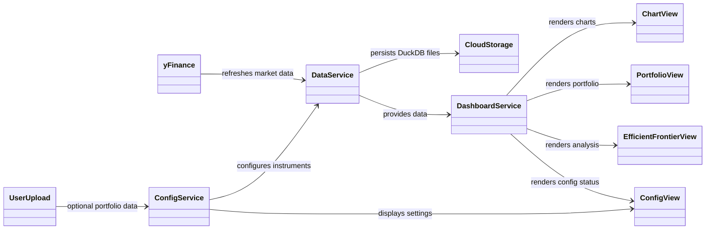

# STONKULATOR - DESIGN DOCUMENT

**Project**: Stonkulator: Bob's Personal Stock Portfolio Analysis and Simulation Toolkit 
**Author**: Bob 
**Created on**: 2025-08-09
**Last updated**: 2025-09-14
**Version**: 1.0
**Development Environment**: GCP Cloud Functions, Python, Panel

### 1. **Project Overview** (End-user requirements)

**Purpose:** Stonkulator is a personal stock market dashboard built in python using the Panel and yFinance libraries. Its goal is to display stock market data for selected financial instruments as charts and calculate returns, key statistics and run simulations of relevant market information.

**Solution:** A serverless dashboard using Panel and yFinance deployed via GCP Cloud Functions to display key instrument information across multiple panels. Each panel is dedicated to one goal. The architecture uses modular cloud functions for scalability. Data is cached to improve performance.

**Goals:** 
1. Single instrument analysis section with a chart and multiple technical indicators.
2. Portfolio view with all instruments and key statistics for each.
3. Efficient frontier calculation using all S&P500 stocks and instruments in the portfolio.

**Target Audience:** Single user with several portfolios.

**Scope:** 
- In scope:
	- Equities and ETF instruments
	- Daily OHLCV data pulling
	- Charts and dashboards
	- Technical analysis
	- Efficient Frontier Simulations
- Out of scope:
	- Options, Forex, Bonds, CFDs, Crypto instruments
	- Depth of book data (eg. open orders at each price point)
	- Authentication and logins
	- Encryption
	- Trading and broker integration
	- Strategy analysis / simulation
	- Backtesting
	- Logging

### 2. **System Architecture**

**Technology Stack:**
1. **Frontend:** Panel-powered dashboard served via GCP Cloud Functions.
2. **Backend:** Python-based GCP Cloud Functions handling API endpoints and dashboard serving; logic is modularized across multiple cloud functions for scalability and maintainability.
3. **Data Source:** yFinance API provides live stock / financial instrument data. Data is cached to improve performance to a DuckDB database. The architecture is organized for a timeseries friendly querying approach. 
4. **Persistence:** Cloud Storage for DuckDB database files containing market data. No user portfolio data persisted in cloud - uses default S&P 500 or temporary session uploads.

**Major Components:**
- **Cloud Function - Config Service:** Accepts optional user portfolio uploads and provides default S&P 500 portfolio when none provided. No persistent user data storage in cloud.
- **Cloud Function - Data Service:** Pulls live data with yFinance for all instruments. Performs additional calculations. Keeps at least 5 years of daily data for each instrument. Manages data freshness by checking for new daily data. Uses DuckDB as core backend database with files stored in Cloud Storage.
- **Cloud Function - Dashboard Service:** Serves the Panel-powered dashboard with HTTP triggers. Handles frontend routing and rendering.
- Frontend / Chart view: single instrument viewer panel with a large stock chart and key statistics, and technical indicators.
- Frontend / Portfolio view: list of instruments in the users portfolio with key statistics calculated for each.
- Frontend / Efficient frontier view: simulation of the efficient frontier from all available instruments.
- Frontend / Config viewer: a panel to confirm what user config has been loaded and statistics on which instruments are loaded, how many days of data are available and first and last datapoint.

**Data Flow:**

**Key Decisions:**
- GCP Cloud Functions chosen for serverless architecture, automatic scaling, and pay-per-use pricing model.
- Cloud Storage used for DuckDB database persistence with easy integration to Cloud Functions. No user config files stored persistently.
- Panel was chosen over Streamlit because its part of the Jupyter ecosystem and works well with serverless deployments.
- yFinance provides free and very reliable stock data, including critically important adjusted close data. Good enough for this level of analysis.
- DuckDB retained as the database choice due to its excellent analytical performance and file-based nature that works well with Cloud Storage.
- Cloud Functions provide better reliability and availability compared to notebook-based serving approaches.

### 3. **Implementation Plan**

1. **MVP 1: Basic Data Pipeline**: User can access a dashboard showing live stock data for one ticker (^GSPC).
	- [ ] Set up GCP project and enable Cloud Functions, Cloud Storage APIs
	- [ ] Create basic Cloud Function with Panel app fetching one stock with yFinance
	- [ ] Deploy Cloud Function with HTTP trigger
	- [ ] Chart View: display basic stock price chart served via Cloud Function

2. **MVP 2: User Configuration**: User can load list of instruments to see their data.
	- [ ] Create Config Service Cloud Function that accepts optional portfolio uploads
	- [ ] Implement default S&P 500 portfolio when no custom portfolio provided
	- [ ] Make settings view to confirm what portfolio is loaded (default or custom)
	- [ ] Pick instrument from list to change stock chart via Dashboard Service

3. **MVP 3: Portfolio Tracking**: User can track portfolio performance with holdings data.
	- [ ] Portfolio View: show all portfolio instruments in a table together. Make it refresh together with user settings refresh
	- [ ] Calculate and show daily returns in % and absolute, show currency, total P&L for position
	- [ ] Calculate trailing annualized figures: annualized returns and volatility
	- [ ] Add sort and filter features to table: eg. sort by name, % returns, etc.. Add interactive features like action and notes as shown in the example dashboard "portfolio_analyzer.ipynb"

4. **MVP 4: Data Persistence**: Data is stored between sessions, loads quickly and only minimal new data is requested from yFinance.
	- [ ] Set up Data Service Cloud Function with DuckDB for storage with two tables: instrument and daily_prices
	- [ ] Configure Cloud Storage bucket for DuckDB file persistence
	- [ ] Load/save DuckDB files from Cloud Storage on function execution
	- [ ] Add automatic data refresh from yFinance based on today's date
	- [ ] Add caching to all charts (for Panel end-user performance improvement)

5. **MVP 5: Technical Indicators**: Complete when user has professional portfolio analysis tools.
	- [ ] Add technical indicators (EMA 3, 50, 200, ATR, ATR Stop)
	- [ ] Add volume sub chart, with SMA 20 day volume line
	- [ ] Add RSI sub chart
	- [ ] Add SP500 correlation coefficient with a trailing 20 day window
	- [ ] Add risk metrics (annualized volatility, annualized return, Sharpe ratio?)

6. **MVP 6: Efficient Frontier**: Efficient frontier is calculated from available data.
	- [ ] Efficient Frontier view: full page view with chart of efficient frontier estimated from available data by random sampling returns. All units shown in annualized values (annualized returns, annualized volatility). See example "portfolio_optimizer.ipynb"
	- [ ] User portfolio plotted as point on chart to show it's position relative to the efficient frontier

### 4. Tips for solo developers to keep in mind

#### Make It Actionable
- Include checklists for tasks
- Break large items into smaller pieces  
- Set realistic milestones
- Track progress visibly

#### Document Key Decisions
- Why you chose specific technologies
- Trade-offs you considered
- Assumptions you're making
- Changes from original plan

#### Plan for Future You
- Can someone else understand your choices?
- Are important details captured?
- Is it easy to understand why a decision was made?

#### Common Mistakes to Avoid
 - ❌ **Too Much Detail:** Don't document every minor decision
 - ❌ **Too Little Context:** Don't assume future you will remember everything  
 - ❌ **No Updates:** Keep the document current as things change
 - ❌ **Wrong Audience:** Write for the people who need to understand
 - ❌ **No Clear Structure:** Use consistent formatting and organization
 - ❌ **Missing Rationale:** Explain why, not just what
 - ❌ **Ignoring Risks:** Address potential problems upfront
